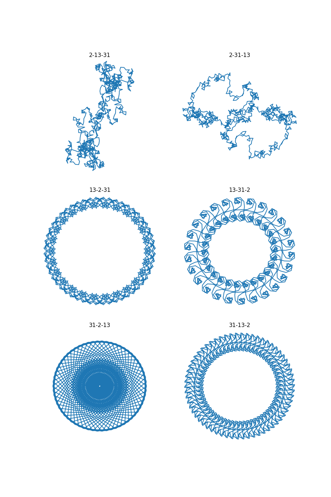

# Exponential Sums

I've stumbled uppon the concept of an exponential sum on John D. Cook's website [Exponentional Sum of the Day][expsum] (please visit the site). Fascinated by the richness and beauty of the patterns generated by these terms, I had to implement them. The first prototype is in Python (with the external dependency [Matplotlib][matplotlib]). I still intend to do one in Rust.

General idea: for positive integers $`n_1,\, \dots,\, n_k`$ take the sums
```math
    z_m =
    \sum_{n=0}^m
        \exp \left( 2\pi i \left(
            \frac{n}{n_1} + \frac{n^2}{n_2} + \dots + \frac{n^k}{n_k}
        \right) \right)
```
as the vertices of a traverse in $`\mathbb{R}^2`$ ($`\mathbb{C}`$), plot it, and be filled with wonder. The best _general_ choice for the length of the traverse seems to be the lowest common multiplier of $`n_1,\, \dots,\, n_k`$. But there are quite some cases where this is too low.

# Numbers


# Days
In the case of a day $`m/d/y`$ the corresponding exponential sum is defined by
```math
    \begin{matrix*}[rcl]
        n_1 & = & m \\
        n_2 & = & d \\
        n_3 & = & y
    \end{matrix*}
```
 (for $`y`$ only the last two digits).

## Examples
### Plots
#### 4/1/2024

#### 4/17/2024

#### 5/19/2024


### Animations
#### 4/1/2024

#### 4/17/2024

#### 5/19/2024


 [expsum]:https://www.johndcook.com/expsum/
 [matplotlib]:https://matplotlib.org/stable/
